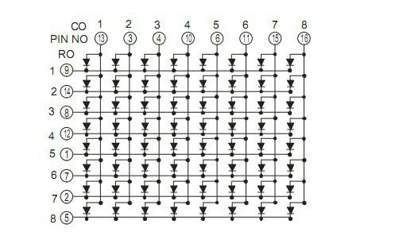

## Milestone 3: Displaying the output on the LED matrix display
### Step 1: Receiving and Deciphering the message on the PC
Same as whatever was done in milestone 2. The message is received over WiFi and deciphered. Upload the updated ESP32 code onto your ESP. Located in ./final_task/milestone3/transmit_password_websocket/transmit_password_websocket.ino

### Step 2: Resending decrypted data back to ESP32
The decrypted data is converted to a list of 20 matrices, each one representing a single letter. Since our word is "LAKHTARUS", only 9 of the 20 letters are used. Each letter is a matrix of 1s and 0s, 1s representing a star and 0s representing a space. 
This data is sent to the ESP32 server.

### Step 3: Converting this List to a usable format for LED Matrix
The data is received in a JSON format, and the data is reconstructed into a matrix of size 8x160 (8x8 per letter) consisting of 1s and 0s where 1s represent LED ON and 0s represent LED off.  We have a temporary matrix of 8x8 which iterates throught the columns of the first long matrix. At each iteration we send the output of the temp matrix to our LED matrix for display. When the temporary matrix is full of 0's, it resets back to the beginning.

### Step 4: Utilizing the LED Matrix
1. Connect according to pin diagram; 

#### Row Mapping (Pins):
| Row Number | Pin |
|------------|-----|
| 1          | 21  |
| 2          | 22  |
| 3          | 23  |
| 4          | 25  |
| 5          | 26  |
| 6          | 27  |
| 7          | 32  |
| 8          | 33  |

#### Column Mapping (Pins):
| Column Number | Pin |
|---------------|-------|
| 1             | 4     |
| 2             | 5     |
| 3             | 13    |
| 4             | 14    |
| 5             | 16    |
| 6             | 17    |
| 7             | 18    |
| 8             | 19    |

  

2. Using this [test all led](led_matrix/test_all_led/test_all_led.ino) we could run all leds one by one 
  
3. Now, we discover an issue with the LED Matrix. We cannot display the whole letter at once. We can demonstrate this using an example. Let's say you wanna turn on points((1,2),(1,6),(3,4))  
To do this, we need to turn on column 2,4 and 6. We will also need to turn on row 1 and 3. However, when we do this, we turn on (1,4), (3,2) and (3,6). To prevent this we use 
[scaninng](led_matrix/display_pattern/display_pattern.ino).

4. So, we turn on necessary LED's in only one row at once. First line is turned on, and after a tiny delay of 1ms, second line is turned on and so on. This effectively appears as a whole to our eyes because of our human image retention time of 16ms. So we effectively achieve a sliding text effect on our LED matrix.

5. Done!!!

### Outputs

https://github.com/user-attachments/assets/64e0fbd5-a0c3-468b-9900-873369a79fb2

https://github.com/user-attachments/assets/343a28c0-091d-4ae0-9c37-55ac918fe2c2